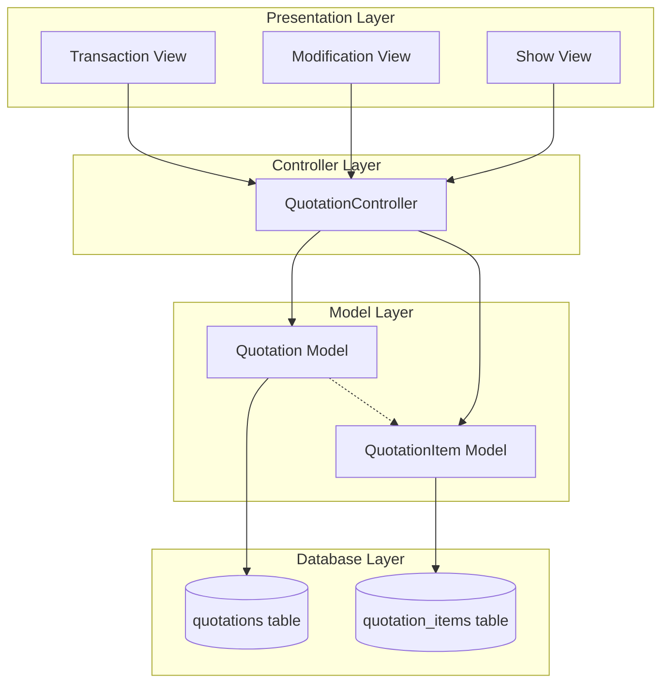

# Design Document: Quotation Module

## Overview

The Quotation module provides a streamlined interface for creating customer quotations/estimates without affecting inventory. Unlike sale transactions, quotations are purely informational documents that capture pricing details for items without batch tracking or stock deduction. The module follows the existing Laravel application patterns with a master-detail structure (Quotation header + QuotationItems).

## Architecture



## Components and Interfaces

### 1. QuotationController

Location: `app/Http/Controllers/Admin/QuotationController.php`

| Method | Route | Description |
|--------|-------|-------------|
| `index()` | GET /admin/quotations | List all quotations |
| `transaction()` | GET /admin/quotations/transaction | Show transaction form |
| `store(Request)` | POST /admin/quotations | Save new quotation |
| `show($id)` | GET /admin/quotations/{id} | View quotation details |
| `modification()` | GET /admin/quotations/modification | Show modification page |
| `edit($id)` | GET /admin/quotations/{id}/edit | Load quotation for editing |
| `update(Request, $id)` | PUT /admin/quotations/{id} | Update existing quotation |
| `cancel($id)` | POST /admin/quotations/{id}/cancel | Cancel quotation |
| `getItems()` | GET /admin/quotations/get-items | Get items for selection |
| `getQuotations()` | GET /admin/quotations/get-quotations | Get quotations list (AJAX) |
| `generateQuotationNo()` | private | Generate unique T.No |

### 2. Quotation Model

Location: `app/Models/Quotation.php`

Relationships:
- `items()` - hasMany QuotationItem
- `creator()` - belongsTo User
- `updater()` - belongsTo User

### 3. QuotationItem Model

Location: `app/Models/QuotationItem.php`

Relationships:
- `quotation()` - belongsTo Quotation
- `item()` - belongsTo Item (optional reference)

### 4. Views

| View | Path | Description |
|------|------|-------------|
| Transaction | `resources/views/admin/quotation/transaction.blade.php` | Create new quotation |
| Modification | `resources/views/admin/quotation/modification.blade.php` | Edit existing quotation |
| Show | `resources/views/admin/quotation/show.blade.php` | View quotation details |
| Index | `resources/views/admin/quotation/index.blade.php` | List all quotations |

## Data Models

### quotations Table

| Column | Type | Description |
|--------|------|-------------|
| id | bigint | Primary key |
| quotation_no | string(50) | Unique transaction number (T.No) |
| series | string(10) | Series prefix (default: 'QT') |
| quotation_date | date | Quotation date |
| customer_name | string(255) | Customer name (free text) |
| discount_percent | decimal(5,2) | Overall discount percentage |
| remarks | text | Remarks |
| terms | text | Terms and conditions |
| net_amount | decimal(12,2) | Net total amount |
| status | enum | 'active', 'cancelled' |
| created_by | bigint | User who created |
| updated_by | bigint | User who last updated |
| created_at | timestamp | Creation timestamp |
| updated_at | timestamp | Update timestamp |

### quotation_items Table

| Column | Type | Description |
|--------|------|-------------|
| id | bigint | Primary key |
| quotation_id | bigint | Foreign key to quotations |
| item_id | bigint | Optional reference to items table |
| item_code | string(50) | Item code |
| item_name | string(255) | Item name |
| packing | string(50) | Packing info |
| company_name | string(100) | Company name |
| location | string(100) | Location |
| qty | decimal(10,3) | Quantity |
| rate | decimal(12,2) | Rate per unit |
| mrp | decimal(12,2) | MRP |
| amount | decimal(12,2) | Line amount (qty * rate) |
| unit | string(20) | Unit of measure |
| row_order | int | Row display order |
| created_at | timestamp | Creation timestamp |
| updated_at | timestamp | Update timestamp |

## Correctness Properties

*A property is a characteristic or behavior that should hold true across all valid executions of a system-essentially, a formal statement about what the system should do. Properties serve as the bridge between human-readable specifications and machine-verifiable correctness guarantees.*

### Property 1: Unique Sequential Quotation Numbers
*For any* sequence of quotation saves, each generated quotation_no SHALL be unique and follow a sequential pattern within the same series.
**Validates: Requirements 1.2**

### Property 2: Batch Quantity Invariant
*For any* quotation save operation, the total quantities in the batches table before and after the operation SHALL be identical.
**Validates: Requirements 1.3**

### Property 3: Line Item Amount Calculation
*For any* quotation item with quantity Q and rate R, the calculated amount SHALL equal Q × R.
**Validates: Requirements 2.1, 2.2**

### Property 4: Net Amount Calculation
*For any* quotation with items and discount percentage D, the net_amount SHALL equal (sum of all item amounts) × (1 - D/100).
**Validates: Requirements 3.1, 3.2**

### Property 5: Quotation Data Round-Trip
*For any* valid quotation data saved to the database, retrieving the quotation by ID SHALL return all header fields and all associated items with identical values.
**Validates: Requirements 1.4, 4.2, 6.1, 6.2**

### Property 6: Update Preserves Quotation Number
*For any* quotation update operation, the quotation_no SHALL remain unchanged from its original value.
**Validates: Requirements 4.3**

### Property 7: Cancel Sets Status Without Deletion
*For any* quotation cancel operation, the quotation record SHALL exist in the database with status='cancelled'.
**Validates: Requirements 4.4**

## Error Handling

| Scenario | Handling |
|----------|----------|
| Validation failure | Return 422 with validation errors |
| Database error during save | Rollback transaction, return 500 with error message |
| Quotation not found | Return 404 with "Quotation not found" message |
| Unauthorized access | Return 403 with "Unauthorized" message |
| Invalid quotation number format | Return 422 with format error |

## Testing Strategy

### Property-Based Testing

The module will use **Pest PHP** with the **pestphp/pest-plugin-faker** for property-based testing. Each correctness property will be implemented as a property-based test that runs a minimum of 100 iterations.

Property tests will be tagged with comments referencing the design document:
```php
// **Feature: quotation-module, Property 1: Unique Sequential Quotation Numbers**
```

### Unit Testing

Unit tests will cover:
- QuotationController methods
- Quotation model relationships
- QuotationItem model relationships
- Amount calculation helpers

### Test Files

| File | Purpose |
|------|---------|
| `tests/Feature/QuotationTest.php` | Feature tests for quotation CRUD |
| `tests/Unit/QuotationCalculationTest.php` | Unit tests for calculations |
| `tests/Property/QuotationPropertyTest.php` | Property-based tests |
